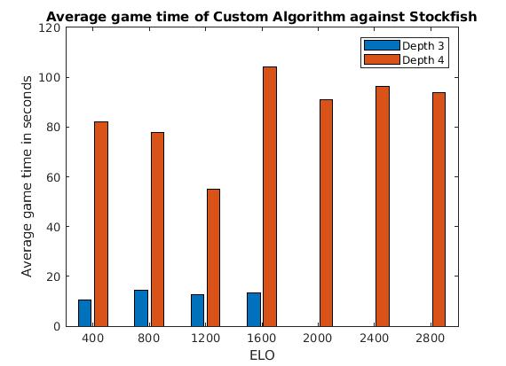
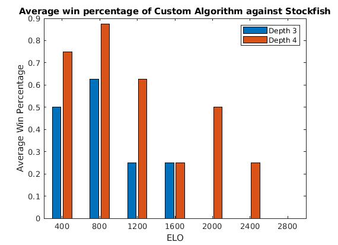
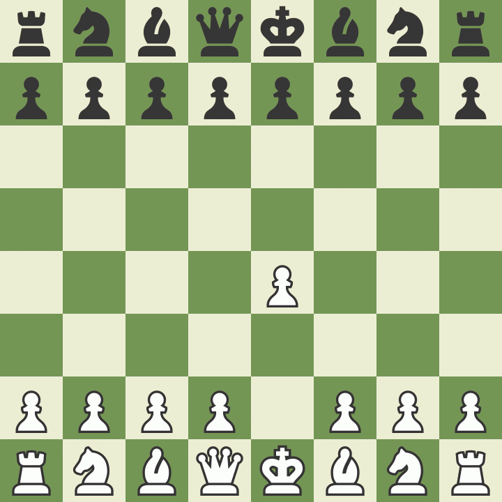

# Overview

Chess has simple rules, but the game
space is extremely large. With the strength
of our current computers, we aren't even
close to solving the game of chess by brute force.
As a fallback, engines use a heuristic to
try to find the best moves for a given player,
which basically traverses a "game tree" (tree
of possible moves for both players) and quantitatively
evaluates the resulting position. This project
primarily focuses on how to efficiently
traverse such a game tree and create an effective
heuristic to maximize the strength of a chess engine.
To test the engine's strength, we have scripts
that allow the engine to play agains humans or Stockfish (a top
open source chess engine) at different rating levels.
Our engine outperformed our expectations, and has
won games against the 2400 rated Stockfish engine,
which basically means this engine is strong enough
to be a titled player in the chess world.

# Background Information

## Game Tree Traversal

### Minimax

The most basic tree traversal is a minimax
algorithm. This algorithm assumes that white
and black will play their optimal moves and
tries to find the most favorable move
_assuming that both players play perfectly_.
Essentially it is a depth first search
at a fixed depth, and once that depth is
reached, a static evaluation of the position
is calculated.
More information can be found [**here**](https://www.chessprogramming.org/Minimax).
While the space complexity of this is negligible,
the time complexity is $m^p$, where each
player has roughly $m$ moves per ply $p$ (a
ply is half of a move or just one turn for one
player). The proof for this is explained in
the linked research.

### Alpha Beta Pruning

A standard minimax traversal can be very slow,
so shortcuts are very useful.
Alpha beta pruning stops traversing a portion
of the game tree that is already known to be
bad. For example, if white makes a move that
is pretty good, then it doesn't have to
go into detail analyzing lines where it loses
a piece because that move is already proven
inferior. By skipping these inferior lines,
the new average runtime is estimated to be
$\sqrt{m^p}$, which can be seen in
[**this research**](https://www.chessprogramming.org/Alpha-Beta).

### ProbCut

This algorithm takes Alpha Beta pruning
to the next level by avoiding portions
of the gamespace that "probably" won't be
the best line. For example, if a good move has
already been found and the current move
being observed seems worse *but isn't
proven to be worse than other moves*, ProbCut
can still choose to stop checking that move.
This makes ProbCut a lot faster, but when it's done
at the same depth as Alpha Beta pruning, it may
perform slightly worse. The benefit, though, is
that faster algorithms can go much deeper in
their searches in the same amount of time,
so a faster search (even if it's less accurate)
can actually be a lot better. More info about
the ProbCut algorithm can be found [**here**](https://www.chessprogramming.org/ProbCut).

## Positional and Material Heuristic

Our evaluation function starts with the base
evaluation of a board from the perspective of
white (which is always the same since board
always starts the same) and then for every
move being tested (for both white and black)
is added to an evaluation stack. The change
in the evaluation value for every move is
calculated by adding the difference of values
for the position of the moved piece, and then
adding any extra changes given by pieces being
taken.

As mentioned above, we have a set of tables
that represent weighting for each piece in
each position on the board. This represents
how good this position is for a given piece.

# Our Implementation

Our project involved creating a python script that
plays chess against itself, Stockfish, and human opponents.
We created a custom class for storing a board and its
heuristic updated in real time, as well as an engine
class that can traverse the tree using any implemented algorithm
at a custom depth.

## What we can do

We built an algorithm that uses minimax
and another algorithm that uses alpha beta
pruning for move prediction. A minimax approach
of depth 3 is as fast as an alpha-beta approach
of depth 4, which shows how our alpha-beta approach
is significantly faster.

We have a heuristic that constantly updates when a new
move is made. Because our heuristic is purely focused
on material and positioning of pieces, this allows us to use
the existing heuristic and only change the moved piece's
evaluation when updating the new heuristic. This saves the
algorithm a lot of time.

Our algorithm has played a variety of games, many
of which are stored in the `games/` folder of the project
repostory as PGN files. It has beat Stockfish in a variety of games
as shown below.

# Results

We ran a set of test games against Stockfish
with different depths of search in our custom algorithm,
we then took these and calculated (a) the average the win
percentage of our algorithm and (b) the average time it
took for the whole game to play out.
You can see these two graphs below.

As shown, the depth 3 engine moved almost immediately.
Given that the games had about 70 moves each, each move took
a fraction of a second. However, it took about one second per
move with the depth 4 engine. The depth 5 engine was so slow 
(it took anywhere from 30s to a couple of minutes per move) that
it did not make sense to even put it on this scale, and
we decided that the depth 4 engine was the strongest
engine that ran within a reasonable time.

The engine performed significantly better at depth 4,
faring well against even 2000-2400 rated opponents, while
the depth 3 engine was still decent against a 1600 opponent.
Further analysis of these games shows that while the
engine is relatively solid, a fixed BFS doesn't know how to
win an endgame where there may be a forced checkmate in,
say, 10 moves, but it just doesn't have the intuition
to see this checkmate so many moves ahead. These can cause
some obviously winning positions to end up drawn for the
engine. Overall, both of these engines were pretty decent.

As a simple test, Andrew (~1650 Elo) played the depth 4
engine and reached a fairly equal endgame which was basically
drawn. The engine seemed to play solid moves and was
a decent opponent.

Our presentation includes GIFs of some of the games
our engine played, and the [**lichess study here**](https://lichess.org/study/MKYC0bO4)
has records of games played with depths 4-5 against Stockfish
ELO 1600-3200. All of the .pgn files (chess notation files)
from our study are in the `games/` folder, or you can
create a new game by running `showdown.py` with custom
settings for engine depth and other information.

<!---

--->
# Conclusions

All in all, we are very happy with the engine we
were created. It is not perfect by any means,
but it is a very decent engine that holds up against
other high level engines. One of the big things we
could do to improve out engine is make its endgame
choices better. We could try and implement an endgame
tablebase which introduces a new heuristic and algorithm
customized for endgame play. We can add features like
ProbCut to make the current search algorithm more efficient.
Finally, an opening book would introduce a third heuristic
and list of precalculated opening moves that reach more
desirable middlegames, since the all-purpose heuristic
we implemented is best suited for middlegames and not
good but not ideal for opening play.
